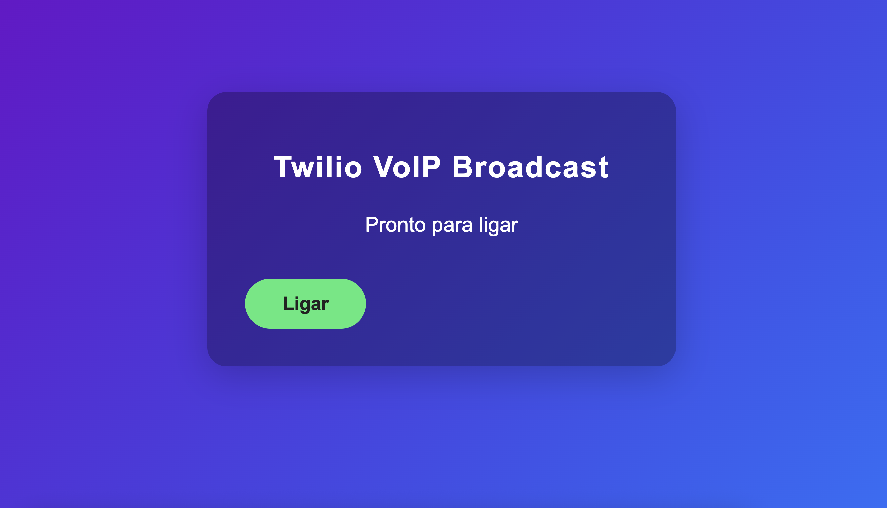

# Twilio Audio Broadcast

This project implements an audio broadcast solution using Twilio Voice API, allowing an administrator to start an audio conference and participants to connect and listen to the broadcast. Unlike traditional web-based audio streaming, this solution uses cellular voice communication instead of mobile data. As a result, it is suitable for events where participants may have unstable or limited mobile internet, since they can join and listen using regular phone calls.

## Features

- **Web Interface**: Simple web page to initialize the system, start/stop the broadcast, and display status.
- **Administration**: The administrator can start the conference and broadcast audio to all participants.
- **Participants**: Can connect to the conference and listen to the audio broadcasted by the administrator.
- **Token Authentication**: Uses JWT tokens generated by the backend to authenticate Twilio clients.
- **Serverless Functions**: Uses protected Twilio functions to manage calls and tokens.

## Project Structure

```
assets/
    server.html            # Alternative/admin interface
functions/
    call.protected.js      # Function to manage calls and conferences
    token.js               # Function to generate JWT access tokens
package.json             # Project dependencies and scripts
```

## How it works

1. **Initialization**: The user accesses the web interface and clicks "Initialize" to prepare the Twilio device.
2. **Start Call**: After initialization, the "Start Call" button is displayed. The administrator can start the audio broadcast.
3. **Conference**: The administrator joins the conference with audio enabled. Participants join with audio muted.
4. **End Call**: The administrator can end the broadcast at any time. A final message will be played to participants.

## Backend (Twilio Functions)

- `call.protected.js`: Manages conference logic. The administrator starts the conference, participants join muted.
- `token.js`: Generates JWT tokens for Twilio client authentication.

## Installation and Execution

1. Install dependencies:
     ```sh
     npm install
     ```
2. Configure Twilio environment variables (`ACCOUNT_SID`, `API_KEY_SID`, `API_KEY_SECRET`, `APP_SID`).
3. Start the local server:
     ```sh
     twilio serverless:dev
     ```
4. Access the web interface at `http://localhost:3000` (or configured port).

## Technologies Used
- Twilio Voice API
- Twilio Functions
- Node.js
- HTML/CSS/JavaScript

## License
This project is licensed under the MIT license.
# Twilio Audio Broadcast

Este projeto implementa uma solução de transmissão de áudio (broadcast) usando Twilio Voice API, permitindo que um administrador inicie uma conferência de áudio e participantes possam se conectar para ouvir a transmissão.

## Funcionalidades

- **Interface Web**: Página web simples para inicializar o sistema, ligar/desligar a transmissão e exibir o status.
- **Administração**: O administrador pode iniciar a conferência e transmitir áudio para todos os participantes.
- **Participantes**: Podem se conectar à conferência, ouvindo o áudio transmitido pelo administrador.
- **Autenticação via Token**: Utiliza tokens JWT gerados pelo backend para autenticar clientes Twilio.
- **Funções Serverless**: Utiliza funções protegidas do Twilio para gerenciar chamadas e tokens.

## Estrutura do Projeto

```
assets/
	screenshot.png         # Imagem ilustrativa da interface
	index.html             # Interface principal do usuário
	server.html            # Interface alternativa/admin
functions/
	call.protected.js      # Função para gerenciar chamadas e conferências
	token.js               # Função para gerar tokens JWT de acesso
package.json             # Dependências e scripts do projeto
```

## Como funciona

1. **Inicialização**: O usuário acessa a interface web e clica em "Inicializar" para preparar o dispositivo Twilio.
2. **Ligar**: Após inicializar, o botão "Ligar" é exibido. O administrador pode iniciar a transmissão de áudio.
3. **Conferência**: O administrador entra na conferência com áudio liberado. Participantes entram com áudio mutado.
4. **Desligar**: O administrador pode encerrar a transmissão a qualquer momento. Uma mensagem final para usuários participantes será dita.

## Backend (Twilio Functions)

- `call.protected.js`: Gerencia a lógica de conferência. O administrador inicia a conferência, participantes entram mutados.
- `token.js`: Gera tokens JWT para autenticação dos clientes Twilio.

## Instalação e Execução

1. Instale as dependências:
	 ```sh
	 npm install
	 ```
2. Configure as variáveis de ambiente Twilio (`ACCOUNT_SID`, `API_KEY_SID`, `API_KEY_SECRET`, `APP_SID`).
3. Inicie o servidor local:
	 ```sh
	 twilio serverless:dev
	 ```
4. Acesse a interface web em `http://localhost:3000` (ou porta configurada).

## Tecnologias Utilizadas
- Twilio Voice API
- Twilio Functions
- Node.js
- HTML/CSS/JavaScript

## Licença
Este projeto está sob a licença MIT.
